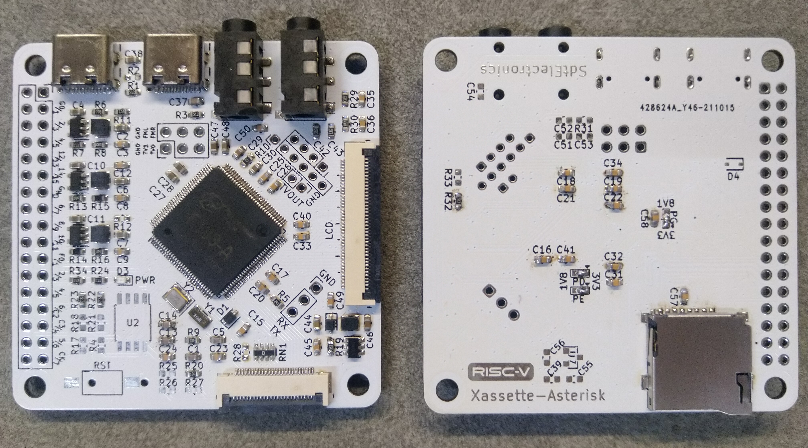

# Xassette-Asterisk
Evaluation board for AllWinner's RISC-V 64 SoC F133/D1s

## Status
Tested with official BSP: boot successful

## Highlights
* Breaks out all IOs, involving analog peripherals, in a compact 56*56mm 2-layer board
* Comes with standard interfaces including USB, micro SD, LCD, Line-in and headphone
* Optimized components arrangement for soldering on heating tables

## Licence
This project is available under the [CERN OHL-w v2](https://ohwr.org/project/cernohl/wikis/Documents/CERN-OHL-version-2) licence. 