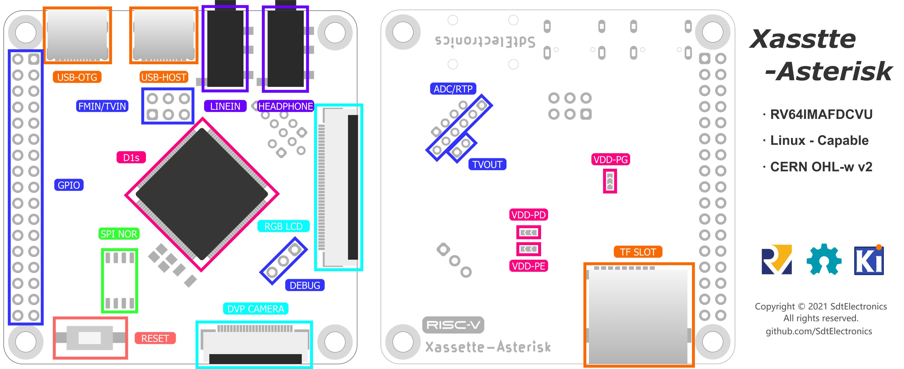
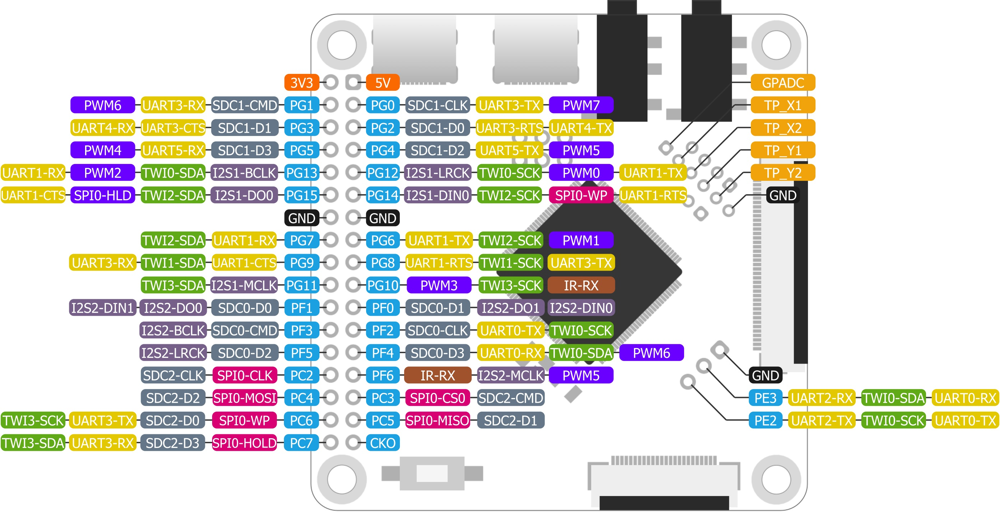
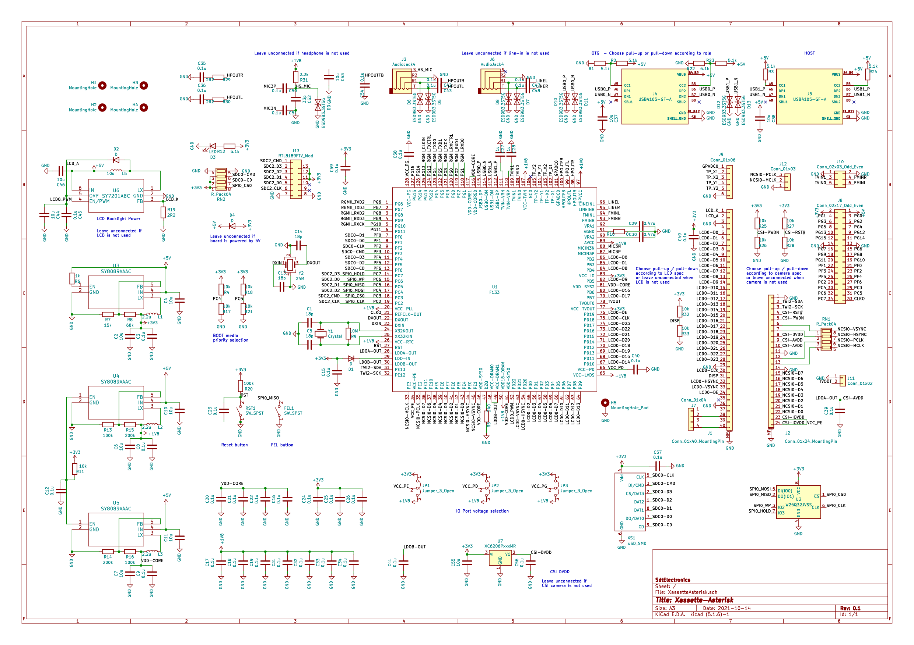

# Xassette-Asterisk
Evaluation board for AllWinner's RISC-V 64 SoC F133/D1s

## Highlights
* Breaks out all IOs, involving analog peripherals, in a compact 56*56mm 2-layer board
* Comes with standard interfaces including USB, micro SD, LCD, Line-in and headphone
* Optimized components arrangement for soldering on a hot plate

## About the Chip
D1s/F133: RISC-V 64 single core @1.008G with in package 64MB DDR2

## Guides
[Quick Start](docs/quickStart.md)

[Troubleshooting](docs/troubleshooting.md)

[Wi-Fi](docs/WiFi.md)

## Pin Out

Pins for LCD and DVP camera can also be used as IOs. See schematic below for detailed pin assignment.

## Schematic & BOM

The schematic in KiCAD format is available under [hw](hw/). BOM in csv format is at [docs/BOM.csv](docs/BOM.csv), and kitspace provides an [online BOM](https://kitspace.org/interactive_bom/?github.com/SdtElectronics/Xassette-Asterisk). Do note that many components are optional (required by some specific peripherals)!

## Notes
* Leave all BOOT selection resistors unconnected if only one BOOT media is present
* Choose load capacitors according to specs of crystals
* When board is to be powered by 3.3V, connect to the power via the 3.3V pin of the pinheader, and `D4` should be soldered. Note USB host will not work properly in this condition due to the absence of 5V power.

## Accessories
### IO Expansion Board
To make use of IOs in the LCD port easier, [this expansion board](hw/auxiliary/Brk40p) converts all nets from FPC to 2.54mm pin headers with labeled IO indices. For 24pin DVP port, there is also an [expansion board](https://github.com/SdtElectronics/Biscuits/tree/master/24P_FPC_FFC_Breakout) but with no labels.

## CHANGELOG
### hw v0.2 
* Added WiFi Module on `sdc2`, sharing pins with SPI Flash
* Added FEL button
* Added ESD protection on USB and audio jacks
* Changed pin headers of TVIN and FMIN (`J10`) to 2x3 2.00mm to optimize routing of USB
### hw v0.3
* Fix pull-up/down resistors for USB-PD role detection
* Align voltage of `VDDIO` in DVP interface with `VCC-PE`

## FAQ
> Are you going to sell some manufactured boards?

No. I have no time and resource to batch manufacture this board. Some commercial boards should come in a couple of months (not from me).

> Where to buy some D1s chips?

There are several suppliers providing samples on taobao.

> More information? Like what can this board do now?

The progress of this project is logged at [this Hackaday page](https://hackaday.io/project/182389-the-cheapest-risc-v-64-computer-by-now), and this repository will contain the source and documentation of this board only. Currently this board can boot up the tina Linux system (an OpenWRT fork by Allwinner) and populate a shell prompt via the serial, drive a parallel RGB display, play sounds via the headphone socket, and record audio from MIC. More functionalities will be tested in the future.

**Additional Words**

This project has gained unexpected popularity since the announcement. Thanks for all the interest! However, I am merely an enthusiast with limited time can be put on this, so I am sorry to disappoint who want to buy one. It is perfectly Okay if someone want to put this into production, as long as my work is acknowledged and the Licence is followed (better if you could contact me in advance). 

D1s is an awesome chip with many features to be exploited. Designing a PCB is not hard as the arrangement of pins is quite thoughtful. The crucial part is correct values of some key components, and they were all marked in the schematic. A symbol of D1s with annotated pins is also included in this repository, so this should also be a good start point for your own design.

## Licence
This project is available under the [CERN OHL-w v2](https://ohwr.org/project/cernohl/wikis/Documents/CERN-OHL-version-2) licence. 